 

 

 

  

 

## 🛠️ Technologies

### Mobile

### Web & Backend

### Data, Tools & Other Languages

### Design & Productivity

  
  &nbsp;&nbsp;
  
  &nbsp;&nbsp;
  
  &nbsp;&nbsp;
  

<b>Photoshop · Word · Excel · PowerPoint</b>

## 📊 Activity

